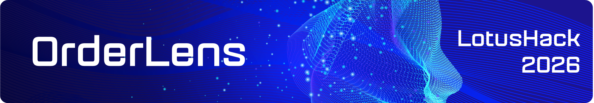
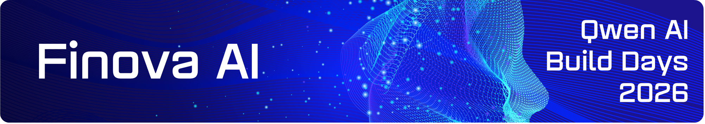

<strong>Building applied AI products for real-world operations.</strong>

MindForgeLabs turns high-friction workflows into focused software products powered by AI.

We build products where AI is not a gimmick, but a clear layer of leverage across verification, document intelligence, and operational decision-making.

<a href="https://github.com/MindForgeLabs">Explore our projects</a>

## Selected Work

  <table>
    <tr>
      <td align="center" width="120">
         
        <b>Next.js</b>
      </td>
      <td align="center" width="120">
         
        <b>React</b>
      </td>
      <td align="center" width="120">
         
        <b>TypeScript</b>
      </td>
      <td align="center" width="120">
         
        <b>Tailwind</b>
      </td>
      <td align="center" width="120">
         
        <b>Vision AI</b>
      </td>
    </tr>
  </table>

<strong>Retail verification, redesigned for speed and accuracy.</strong>

  <table>
    <tr>
      <td align="center">
        <a href="https://devpost.com/software/orderlens">
          
          <strong> View Full Devpost Submission →</strong>
        </a>
      </td>
      <td align="center">&nbsp;&nbsp;&nbsp;</td>
      <td align="center">
        <a href="https://github.com/mindforge-labs/LotusHack26_OrderLensV2">
          
          <strong> Explore Repository →</strong>
        </a>
      </td>
    </tr>
  </table>

OrderLens is built for one of the most fragile moments in food service operations: the final handoff. In fast-moving POS environments, small mistakes in item selection or quantity quickly turn into customer frustration, wasted remakes, and slower service during peak hours.

Instead of relying entirely on manual checking, OrderLens adds a verification layer between the order in the system and the tray in front of the cashier.

- **What it solves:** catches missing, extra, or incorrect items before the order leaves the counter
- **How it works:** compares expected order data with AI-detected tray contents
- **Why it matters:** improves accuracy, reduces avoidable handoff errors, and supports smoother service under pressure

Built for retail and restaurant workflows, OrderLens combines cashier-friendly UX, AI vision, and review surfaces into one operational experience. It is designed to feel less like a generic AI demo and more like a practical control point for speed, confidence, and service quality.

**Why it stands out**

- clear workflow fit instead of broad “AI for retail” positioning
- productized verification rather than raw model output
- designed around operational trust, not just technical novelty

**Focus:** tray verification, mismatch detection, cashier workflow, audit visibility

---

  <table>
    <tr>
      <td align="center" width="120">
         
        <b>Next.js</b>
      </td>
      <td align="center" width="120">
         
        <b>FastAPI</b>
      </td>
      <td align="center" width="120">
         
        <b>PostgreSQL</b>
      </td>
      <td align="center" width="120">
         
        <b>MinIO</b>
      </td>
    </tr>
    <tr>
      <td align="center" width="120">
         
        <b>PaddleOCR</b>
      </td>
      <td align="center" width="120">
         
        <b>OpenCV</b>
      </td>
      <td align="center" width="120">
         
        <b>Python</b>
      </td>
      <td align="center" width="120">
         
        <b>LLMs</b>
      </td>
    </tr>
  </table>

<strong>Document intelligence for modern fintech workflows.</strong>

  <table>
    <tr>
      <td align="center">
        <a href="https://devpost.com/software/finova-ai">
          
          <strong> View Full Devpost Submission →</strong>
        </a>
      </td>
      <td align="center">&nbsp;&nbsp;&nbsp;</td>
      <td align="center">
        <a href="https://github.com/mindforge-labs/QwenHackathon_FinovaAI">
          
          <strong> Explore Repository →</strong>
        </a>
      </td>
    </tr>
  </table>

FinovaAI is built for teams that handle large volumes of financial paperwork under pressure. In lending and KYC workflows, documents arrive in inconsistent formats, critical fields must be extracted manually, and reviewers spend too much time validating information that should already be structured and ready to use.

FinovaAI turns that fragmented process into a more scalable document workflow.

- **What it solves:** reduces manual effort across intake, extraction, and validation
- **How it works:** ingests raw files, applies OCR and AI extraction, then prepares data for review
- **Why it matters:** helps teams process sensitive documents faster without losing the oversight required in high-trust operations

By combining OCR, backend services, storage, and LLM-based extraction, FinovaAI creates a more reliable path from unstructured files to usable financial data. The product is built to improve consistency, accelerate review, and make document-heavy operations easier to trust.

**Why it stands out**

- designed for real verification workflows, not generic document AI claims
- keeps humans in the loop where trust and compliance matter
- turns extraction into a product experience, not just a backend capability

**Focus:** OCR, extraction, validation, reviewer workflow, document operations

---

## What We Believe

The best AI products are not broad promises. They are focused systems built around a specific operational problem, a clear user flow, and a result people can trust.

That is the standard MindForgeLabs builds toward.

---

## Current Direction

MindForgeLabs is currently showcasing two competition-driven product bets:

- `OrderLens` for retail and POS verification
- `FinovaAI` for fintech document intelligence

More applied AI products and experiments will be added as the portfolio grows.
